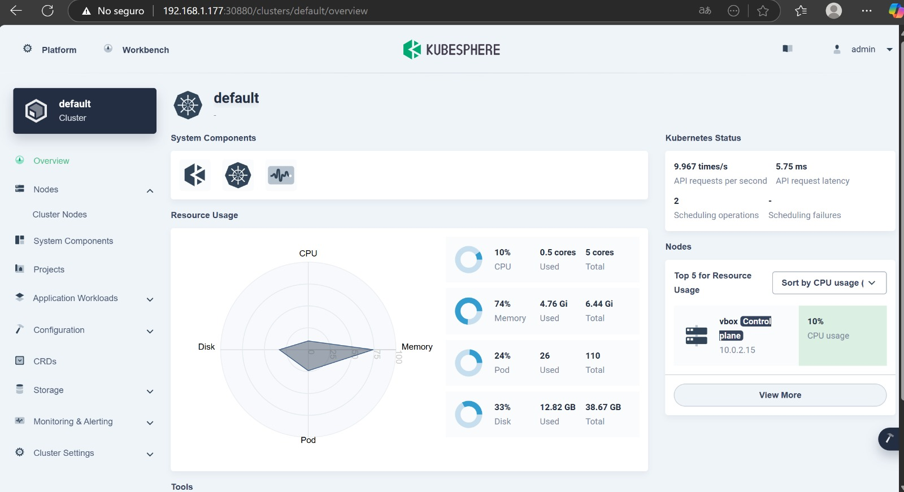
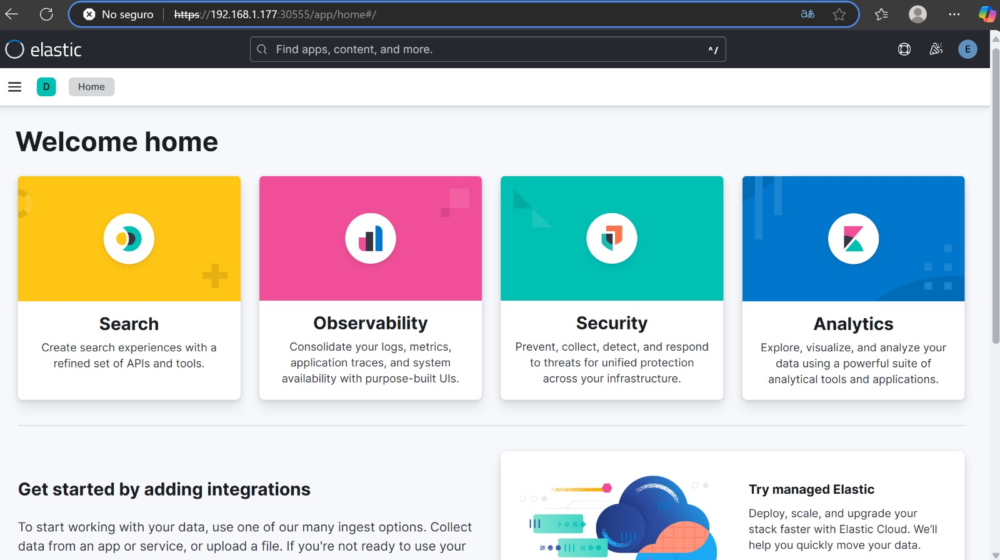

# DevOps ELK & Web: Monitoreo y Despliegue en KubeSphere
Este proyecto es basado en una prueba profesional para evaluar las habilidades de estudiantes para el area de Seguridad logica-Telconet
  
 
Este documento detalla los pasos para la instalación y configuración de un entorno DevOps utilizando ELK Stack y el despliegue de una aplicación web en KubeSphere.
--Kubernetes y ELK Stack:
- Se requiere que se despliegue kubesphere "All-in-One" en la VM proporcionada.
- Una vez desplegado el ambiente de kubernetes, proceder con la instalación de Elastic Cloud on Kubernetes cumpliendo los siguientes puntos:
- Todos los componenetes que se levanten deben estar dentro del namespace "elk-stack-ns".
- La versión del Custom Resource Definition del ELK debe ser la 2.12
- La versión de las imagenes a usar de elasticsearch, kibana y logstash sea 8.13.
- El cluster de elasticsearch debe tener como nombre "elk-cluster".
- Se espera que el Kibana pueda ser accedido desde el puerto 30555 via web

---

## 1. Instalación de la VM para el Servidor

### 1.1 Requisitos de la VM
- **Sistema Operativo**: AlmaLinux 8
- **CPU**: Mínimo 6 vCPUs
- **RAM**: Mínimo 9GB
- **Almacenamiento**: Mínimo 50GB

### 1.2 Configuración de la VM
```bash
# Actualizar paquetes
dnf update -y

# Configurar hostname
hostnamectl set-hostname kubesphere-server
```

---

## 2. Instalación de KubeSphere All-in-One

### 🔧 Requisitos Previos  

Antes de comenzar con la implementación, asegúrate de cumplir con los siguientes requisitos:  

#### 📌 Dependencias del Sistema  

| Dependencia  | Kubernetes ≥ 1.18 | Kubernetes < 1.18 |
|-------------|-------------------|-------------------|
| `socat`     | Obligatorio       | Opcional pero recomendado |
| `conntrack` | Obligatorio       | Opcional pero recomendado |
| `ebtables`  | Opcional pero recomendado | Opcional pero recomendado |
| `ipset`     | Opcional pero recomendado | Opcional pero recomendado |

```bash
sudo dnf install -y socat conntrack-tools ebtables ipset
```

#### 📌 Descargar KubeKey
```bash
curl -sfL https://get-kk.kubesphere.io | VERSION=v3.0.7 sh -
```
Hacer ejecutable:kk

```bash
chmod +x kk

```
#### 📌 Introducción a la instalación
Comando para instalar kubesphere All in On
```bash
./kk create cluster --with-kubernetes v1.22.12 --with-kubesphere v3.3.2
```

Comando para verificar la instalacion correcta: 
```bash
kubectl logs -n kubesphere-system $(kubectl get pod -n kubesphere-system -l 'app in (ks-install, ks-installer)' -o jsonpath='{.items[0].metadata.name}') -f
```
Resultado
```bash
#####################################################

###              Welcome to KubeSphere!           ###

#####################################################


Console: http://192.168.0.2:30880

Account: admin

Password: P@88w0rd


NOTES：

  1. After you log into the console, please check the

     monitoring status of service components in

     "Cluster Management". If any service is not

     ready, please wait patiently until all components 

     are up and running.

  2. Please change the default password after login.


#####################################################

https://kubesphere.io             20xx-xx-xx xx:xx:xx

#####################################################
```

Acceder a la UI de KubeSphere desde `http://<IP-SERVIDOR>:30880`

---

## 3. Despliegue de ELK Stack en KubeSphere

### 3.1 Creación del Namespace
```bash
kubectl create namespace elk-stack-ns
```

### 3.2 Instalación de Elastic Cloud on Kubernetes (ECK)
```bash
kubectl apply -f https://download.elastic.co/downloads/eck/2.12/crds.yaml
kubectl apply -f https://download.elastic.co/downloads/eck/2.12/operator.yaml
```

### 3.3 Despliegue de Elasticsearch
```bash
cat <<EOF | kubectl apply -f -
apiVersion: elasticsearch.k8s.elastic.co/v1
kind: Elasticsearch
metadata:
  name: elk-cluster
  namespace: elk-stack-ns
spec:
  version: 8.13.1
  nodeSets:
  - name: default
    count: 1
    config:
      node.store.allow_mmap: false
EOF
```

### 3.4 Despliegue de Kibana
```bash
cat <<EOF | kubectl apply -f -
apiVersion: kibana.k8s.elastic.co/v1
kind: Kibana
metadata:
  name: kibana
  namespace: elk-stack-ns
spec:
  version: 8.13.1
  count: 1
  elasticsearchRef:
    name: elk-cluster
  http:
    service:
      spec:
        ports:
          - name: http
            port: 5601  # El puerto predeterminado de Kibana
            nodePort: 30555  # El puerto de acceso desde fuera del clúster
        type: NodePort
EOF

```

Kibana accesible en `http://<IP-SERVIDOR>:30555`

---

## 4. Despliegue del Portafolio Web en KubeSphere
Codigo de la aplicacion: https://github.com/jntobar/Portafolio-HTML-CSS-JS

### 4.1 Creación del Namespace para la Aplicación
```bash
kubectl create namespace web-portfolio
```

### 4.3 Despliegue en KubeSphere
```bash
cat <<EOF | kubectl apply -f -
apiVersion: apps/v1
kind: Deployment
metadata:
  name: portfolio-deployment
  namespace: web-portfolio
spec:
  replicas: 1
  selector:
    matchLabels:
      app: portfolio
  template:
    metadata:
      labels:
        app: portfolio
    spec:
      containers:
        - name: portfolio
          image: jntobar/mi-portafolio:v1
          ports:
            - containerPort: 80
EOF
```

### 4.4 Creación del Service
```bash
cat <<EOF | kubectl apply -f -
apiVersion: v1
kind: Service
metadata:
  name: portfolio-service
  namespace: web-portfolio
spec:
  type: NodePort
  selector:
    app: portfolio
  ports:
    - protocol: TCP
      port: 80
      targetPort: 80
      nodePort: 30001
EOF
```

La aplicación es accesible desde `http://<IP-SERVIDOR>:30001`


¡Con esto tienes un entorno funcional con ELK para monitoreo y un portafolio web desplegado en KubeSphere! 🎉


